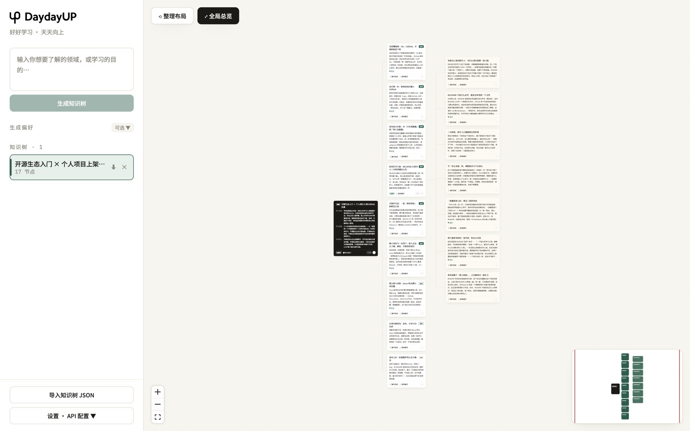
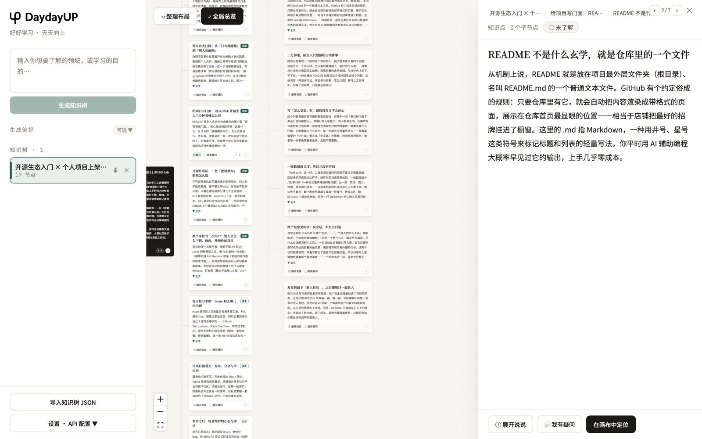

<div align="center">


# DaydayUP

**好好学习，天天向上 · 从 0 到 1 长出知识树**

*A local-first AI learning tool: chase every question to the bottom, without ever losing the main thread.*

`Local-first` · `Bring your own API key` · `MIT` · `React + React Flow`

[快速开始](#-快速开始quick-start) · [English Introduction](#-english-introduction)

</div>

---



## 💡 这是什么 / What is this

学一个陌生领域，真正卡住你的往往不是找不到资料——AI 已经能给你一份像样的学习大纲。卡住你的是**追问的代价**：

- 讲到某个细节没看懂，顺着好奇心问下去，几轮之后**主线已经被带偏**
- 想回到刚才那一章接着学，只能往上翻聊天记录，**上下文早被污染了**
- 于是你要么憋着不问（留下一个夹生的概念），要么一路问到底（丢了主干）

**DaydayUP 就是为这件事写的：让你随时开小差，也随时回得来。**

输入学习领域或目标，AI 先提炼一份学习档案（你是谁、学完要做什么、什么不用学），长出一棵为这个目标定制的主干。之后任意一张卡片都能「展开说说」（AI 分层讲透）或「我有疑问」（就这一点提出你自己的疑问）——**追问长在那张卡片下面，是一条独立分支，主干纹丝不动**。看明白了随手折叠，主线还在原地等你。

打破砂锅问到底，又永远丢不了主线。学完留下的不是一堆翻不动的聊天记录，而是一棵你自己的知识树。

---

When you're learning an unfamiliar field, the hard part usually isn't finding material — AI can already hand you a decent syllabus. The hard part is **what a follow-up question costs you**:

- You don't get some detail, you follow your curiosity, and a few turns later **the main thread has drifted**
- To pick up where you left off you scroll back through the chat — **the context is already polluted**
- So you either swallow the question (and keep a half-understood idea) or chase it down (and lose the trunk)

**DaydayUP is built for exactly that: wander off whenever you want, and always come back.**

Type what you want to learn and *why* — the AI distills a **learning profile** (who you are, what you're learning for, what to skip) and grows a trunk customized for that goal. Any card can then be expanded ("Explain further") or questioned ("I have a question") — **the follow-up grows underneath that card as its own branch, and the trunk never moves**. Collapse it when you're done; the main line is right where you left it.

Chase every question to the bottom without ever losing the thread. What you're left with isn't a chat log you'll never scroll through again — it's your own knowledge tree.

## ✨ 核心特性 / Features

| | |
|---|---|
| 🧭 **学习档案驱动** Profile-driven | 不是通用百科：先提炼你的背景/目标/视角，整棵树按目标定制，主干标注「先学 / 重要 / 按需」优先级 |
| 🌳 **双模式下探** Two explore modes | 「展开说说」AI 分层讲透一个主题；「我有疑问」就地生成专属回答分支——**追问只长在那张卡片下面，不污染主干** |
| 🗺️ **无限画布** Infinite canvas | 层级列宽对齐、卡片永不重叠（碰撞解算）、拖动卡片=移动整条分支、折叠回溯、Canvas 超级缩略图导航 |
| 📝 **讲义不是词典** Lecture, not dictionary | 先直觉后术语，优先用你熟悉的领域打比方（在偏好里填"你的背景"）、内容长短随需要 |
| 📊 **学习状态** Learning states | 未了解 / 已掌握 / 盲区 三态标记，小地图一眼看出盲区分布 |
| 🔒 **本地优先** Local-first | 数据全部存浏览器本地，可导出/导入 JSON 备份与分享；自带 API Key，不经过任何第三方服务器 |



## 🚀 快速开始 / Quick Start

```bash
# 1. 克隆仓库 Clone
git clone https://github.com/ztongw-ai/daydayup.git
cd daydayup

# 2. 安装依赖 Install
npm install

# 3. 配置你的 API Key Configure your API key
cp .env.example .env.local
#    编辑 .env.local，填入你的智谱 GLM API Key（https://bigmodel.cn 控制台获取）

# 4. 启动 Run
npm run dev
```

打开 `http://localhost:5173`，输入一个学习目标（比如「我想把自己的个人项目开源上架，产品出身、没写过开源项目、不懂协议和社区规矩」），等 30~60 秒，你的第一棵知识树就长出来了。

> 🔑 **Key 说明**：应用调用任何 OpenAI 兼容端点（默认智谱 GLM），Key 只存在你本地浏览器，可随时在应用「设置」里更换端点和模型。

## 📖 学习方法论 / Methodology

产品背后是三个成熟的学习科学原则：

1. **语义树学习法**（Semantic Tree）——先骨架后细节：先建立领域主干，再按需下探，杜绝线性死记
2. **问题驱动式解构**——「缺什么补什么」：你的疑问就是你的知识盲区，AI 按疑问生成专属分支
3. **非线性认知**——人脑探索陌生领域是跳跃、深挖、回溯的；无限画布 + 可折叠分支正好匹配这种习惯

## ⚠️ 项目状态 / Project Status

这是我（非工程背景的产品人）为自己写的自用工具，以 **as-is** 方式开源分享，希望对有同样困惑的人有一点帮助。

- UI 目前为中文（欢迎 PR 贡献 i18n 🙌）
- **不承诺活跃维护**：Issue 可能不回复，请见谅 / Not actively maintained — issues may not get replies, sorry!
- 想法类 Feature（欢迎自取）：Anki/Markdown 导出、知识树分享站、深色主题、移动端

## 🛠️ 技术栈 / Tech Stack

React 19 · TypeScript · [@xyflow/react](https://reactflow.dev)（React Flow v12）· dagre 自动布局 · Vite · 自托管 Noto Serif/Sans SC 字体

> 一点工程细节：画布的"永不重叠"由布局层的碰撞解算保证（每帧解算 + 子树整体拖拽 + 历史数据自愈）；受控节点的尺寸测量回传解决了 React Flow v12 的节点隐藏竞态。

## 📄 License

[MIT](LICENSE) · Copyright © 2026 ztongw-ai & DaydayUP contributors

---

## 🇬🇧 English Introduction

**DaydayUP** — *chase every question to the bottom, without ever losing the main thread.*

A local-first, bring-your-own-key AI learning tool for anyone entering an unfamiliar field. AI chat can already give you a syllabus; what it can't do is let you dig into a detail without derailing the lesson. Here, every follow-up becomes its own branch hanging off the card that prompted it — **the trunk never moves**, so you can wander off and come back at will. It distills a **learning profile** from your goal (your background, what you're learning for, what to skip), then grows a customized tree with learning priorities (Learn-first / Important / On-demand).

**How you learn with it:**

1. Type your learning goal — even a full sentence about who you are and why you're learning
2. AI distills your profile and grows a trunk of 6–10 customized modules
3. On any card: **"Explain further"** lets AI break the topic down into layered sub-cards; **"I have a question"** creates a personal answer branch from your own doubt
4. Explore recursively on an infinite canvas — cards never overlap, drag moves a whole branch, collapse to zoom back to the skeleton, track mastery states (unknown / mastered / blind-spot)

Everything stays in your browser (export/import JSON to back up or share your learning paths). Works with any OpenAI-compatible endpoint (Zhipu GLM by default).

**Status:** a personal tool shared as-is; not actively maintained. Chinese UI for now — i18n PRs welcome.

**Quick start:** `git clone` → `npm install` → copy `.env.example` to `.env.local` with your API key → `npm run dev`.
